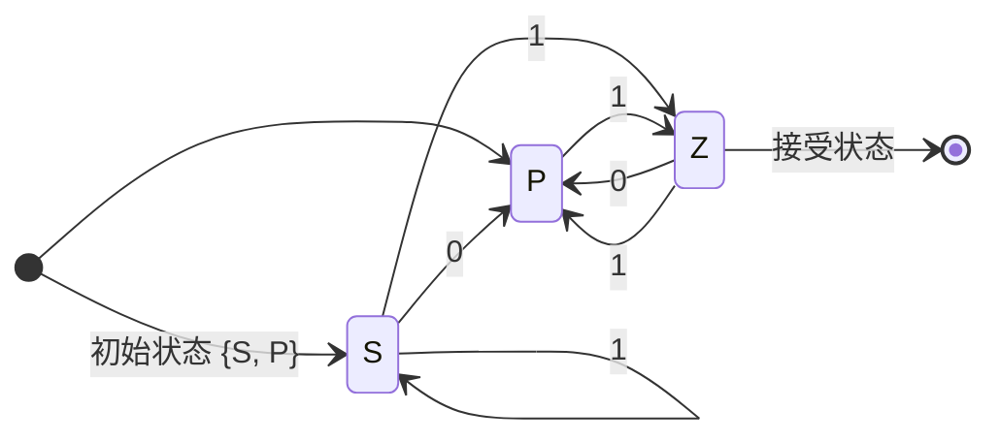
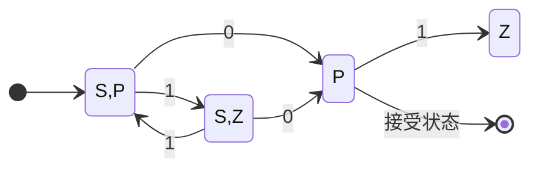

# 第三单元 DFA与NFA

NFA的状态转换图喵

```mermaid
stateDiagram-v2
    direction LR
    state "S" as S
    state "P" as P
    state "Z" as Z
    [*] --> S: 初始状态 {S, P}
    [*] --> P
    S --> P: 0
    S --> S: 1
    S --> Z: 1
    Z --> P: 0
    Z --> P: 1
    P --> Z: 1
    Z --> [*]: 接受状态

```

简化后的DFA

```mermaid
stateDiagram-v2
    direction LR
    state "S,P" as SP
    state "P" as P
    state "S,Z" as SZ
    state "Z" as Z
    [*] --> SP
    SP --> P: 0
    SP --> SZ: 1
    P --> Z: 1
    SZ --> P: 0
    SZ --> SP: 1
    P --> [*]: 接受状态
```
